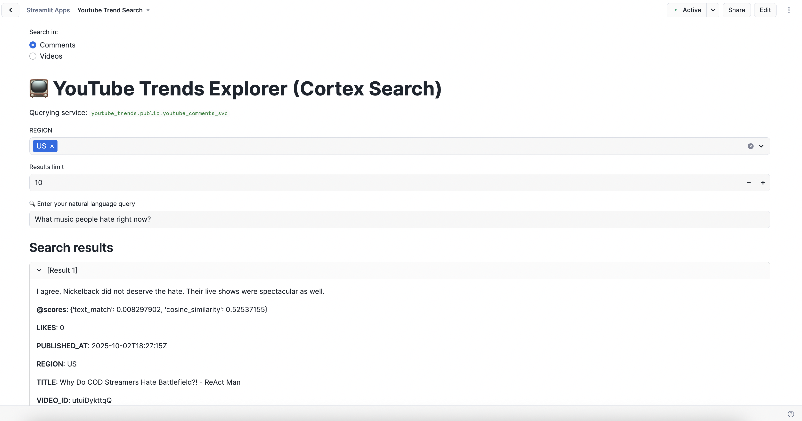
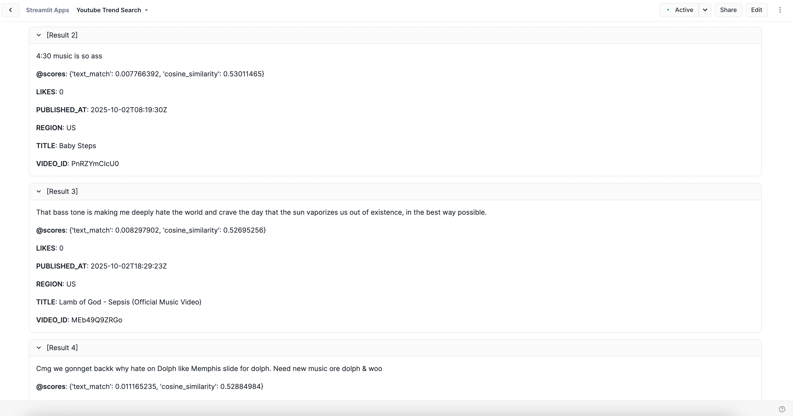

# 📺 YouTube Trends Explorer with Snowflake Cortex

## 🚀 Project Overview

This project collects trending YouTube videos + comments across multiple countries, ingests them into **Snowflake**, and powers a **Streamlit app (inside Snowsight)** that lets you **explore trends using natural language queries powered by Cortex Search**.

### Tech Stack

* **Python** → extract data from the YouTube Data API
* **Docker** → containerized data extraction for reproducibility
* **NDJSON** → store raw videos and comments data
* **Snowflake SQL** → ingestion
* **Snowflake Cortex** → semantic search
* **Streamlit (in Snowsight)** → interactive frontend

---

## 🛠️ Pipeline Architecture

1. **Extraction (Python + Docker)**

   * Uses the YouTube API to fetch trending videos and top comments.
   * Data saved in batches as `.jsonl` files (newline-delimited JSON) files in `/output/`.
   * Supports multiple countries: 🇵🇱 🇺🇸 🇯🇵 🇳🇬 🇧🇷 🇮🇳 🇪🇬

2. **Ingestion (Snowflake SQL)**

   * Load `.jsonl` files into Snowflake with `COPY INTO`.
   * Create `videos` and `comments` tables.

3. **Cortex Integration**

   * Create a **Cortex Search Service** on top of comments and video metadata.
   * Enable **semantic queries** like:

     > “What music are people excited about right now?”

4. **Streamlit App (Snowsight)**

   * Runs **inside Snowflake Snowsight** (no extra deployment needed).
   * Lets users search, filter, and explore trending content.
   * Uses Cortex to deliver natural-language semantic search.

---

## 📂 Repository Structure

```
youtube-content-search/
├── sample_data/             # Pre-collected sample data
│   ├── youtube_trending_videos.jsonl
│   └── youtube_video_comments.jsonl
|
├── extraction/              # Python ETL code
│   ├── main.py              # entrypoint script
│   ├── helpers.py           # API + JSON helpers
│   ├── requirements.txt
│   └── Dockerfile           
│
├── snowflake/               # Snowflake SQL scripts
│   ├── data_ingestion.sql
│   └── cortex_search_service.sql
│
├── app/                     # Streamlit app (runs in Snowsight)
│   └── streamlit_app.py
│
├── README.md
└── .gitignore
```

---

## 📸 Demo (Snowsight)




* Example search: *“Trending videos about AI”*
* Example search: *“Comments related to music”*

---

## ⚡️ Quick Start

### Option A — Extract Fresh Data with Docker

Build the Docker image:

```bash
cd extraction
docker build -t youtube-extraction .
```

Run the extractor (replace `your_api_key_here` with your YouTube Data API key):

```bash
docker run -it --rm \
  -e YOUTUBE_API_KEY=your_api_key_here \
  -v $(pwd)/output:/app/output \
  youtube-extraction
```

This saves raw data into:

* `output/youtube_trending_videos.jsonl`
* `output/youtube_video_comments.jsonl`

### Option B — Use Sample Data (skip extraction)

If you don’t want to set up the YouTube API, you can use the pre-collected sample data included in this repo:

- `sample_data/youtube_trending_videos.jsonl`
- `sample_data/youtube_video_comments.jsonl`

This lets you try the Snowflake + Cortex parts of the project right away.

### 2. Load into Snowflake

Run the `snowflake/data_ingestion.sql` and `snowflake/cortex_search_service.sql` SQL scripts inside **Snowsight Worksheets**.

### 3. Launch Streamlit in Snowsight

* Open Snowsight → **Streamlit** → **Create App**
* Paste in the code from `app/streamlit_app.py`
* Connect it to your Snowflake warehouse + database
* Start exploring with Cortex-powered search 🎉
